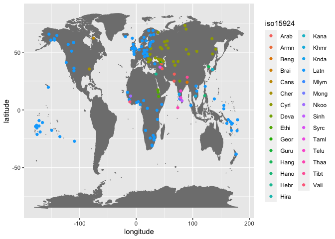

WWSD basic stats
================
Steven Moran <steven.moran@uzh.ch>
04 May, 2020

Data prep
=========

``` r
library(tidyverse)
library(testthat)
library(knitr)
```

Get the data.

``` r
bib <- read.csv('bibliography.tsv', sep="\t", stringsAsFactors = FALSE)
db <- read.csv('database.csv', stringsAsFactors = FALSE)
```

How many data points are there?

``` r
df.scripts <- db %>% select(script) %>% distinct()
message('There are ', nrow(df.scripts), ' data points.')
```

    ## There are 191 data points.

How many graphemes vs IPA symbols are there per data point?

``` r
grapheme.counts <- db %>% select(script, grapheme) %>% group_by(script) %>% summarize(grapheme_count = n())
ipa.counts <- db %>% select(script, IPA) %>% distinct() %>% group_by(script) %>% summarize(ipa_count = n())
counts <- left_join(grapheme.counts, ipa.counts)
```

    ## Joining, by = "script"

``` r
counts %>% head() %>% kable()
```

| script    |  grapheme\_count|  ipa\_count|
|:----------|----------------:|-----------:|
| Abaza     |              146|          72|
| Abkhaz    |              140|          69|
| Acehnese  |              182|          38|
| Adyghe    |              142|          72|
| Afrikaans |               60|          47|
| Aghul     |              102|          51|

On average we expect graphemes to have a one-to-many or one-to-one relationship with their phoneme(s).

``` r
counts[which(!(counts$grapheme_count > counts$ipa_count)),]
```

    ## # A tibble: 11 x 3
    ##    script           grapheme_count ipa_count
    ##    <chr>                     <int>     <int>
    ##  1 Ahtna                        37        37
    ##  2 Ainu (Latin)                 56        56
    ##  3 Dena’ina                     40        40
    ##  4 Hanuno'o                     63        63
    ##  5 Inuktitut                    74        74
    ##  6 Ndyuka (Latin)               29        29
    ##  7 Rutul (Cyrillic)             46        46
    ##  8 seTswana                     32        32
    ##  9 siSwati                      45        45
    ## 10 Vai                         206       206
    ## 11 Xhosa                        59        59

Here's an example of a one-to-one g2p language.

``` r
db %>% filter(script=="Xhosa") %>% head() %>% kable()
```

| script | grapheme | IPA | comment | source                      | omniglot                                     |
|:-------|:---------|:----|:--------|:----------------------------|:---------------------------------------------|
| Xhosa  | a        | a   |         | Kirsch, Scorge, 2003: 15-19 | <https://www.omniglot.com/writing/xhosa.htm> |
| Xhosa  | b        | ɓ   |         | Kirsch, Scorge, 2003: 15-19 | <https://www.omniglot.com/writing/xhosa.htm> |
| Xhosa  | bh       | bʱ  |         | Kirsch, Scorge, 2003: 15-19 | <https://www.omniglot.com/writing/xhosa.htm> |
| Xhosa  | c        | ǀ   |         | Kirsch, Scorge, 2003: 15-19 | <https://www.omniglot.com/writing/xhosa.htm> |
| Xhosa  | ch       | ǀʰ  |         | Kirsch, Scorge, 2003: 15-19 | <https://www.omniglot.com/writing/xhosa.htm> |
| Xhosa  | d        | d   |         | Kirsch, Scorge, 2003: 15-19 | <https://www.omniglot.com/writing/xhosa.htm> |

Some data checks
================

Are there any NULL IPA rows? No.

``` r
expect_equal(nrow(db %>% filter(is.na(IPA))), 0)
```

Are there empty IPA rows? Yes.

``` r
db %>% filter(IPA=="") %>% select(script, grapheme, IPA, comment) %>% kable()
```

| script               | grapheme | IPA | comment                                                                                                                                                           |
|:---------------------|:---------|:----|:------------------------------------------------------------------------------------------------------------------------------------------------------------------|
| Acehnese             | -        |     | initial                                                                                                                                                           |
| Acehnese             | -        |     | medial                                                                                                                                                            |
| Acehnese             | -        |     | initial                                                                                                                                                           |
| Acehnese             | -        |     | medial                                                                                                                                                            |
| Acehnese             | -        |     | initial                                                                                                                                                           |
| Acehnese             | -        |     | medial                                                                                                                                                            |
| Acehnese             | -        |     | initial                                                                                                                                                           |
| Acehnese             | -        |     | medial                                                                                                                                                            |
| Acehnese             | -        |     | initial                                                                                                                                                           |
| Acehnese             | -        |     | medial                                                                                                                                                            |
| Acehnese             | -        |     | initial                                                                                                                                                           |
| Acehnese             | -        |     | medial                                                                                                                                                            |
| Acehnese             | -        |     | initial                                                                                                                                                           |
| Acehnese             | -        |     | medial                                                                                                                                                            |
| Acehnese             | -        |     | initial                                                                                                                                                           |
| Acehnese             | -        |     | medial                                                                                                                                                            |
| Acehnese             | -        |     | initial                                                                                                                                                           |
| Acehnese             | -        |     | medial                                                                                                                                                            |
| Acehnese             | -        |     | initial                                                                                                                                                           |
| Acehnese             | -        |     | medial                                                                                                                                                            |
| Acehnese             | -        |     | initial                                                                                                                                                           |
| Acehnese             | -        |     | initial                                                                                                                                                           |
| Acehnese             | -        |     | medial                                                                                                                                                            |
| Acehnese             | -        |     | medial                                                                                                                                                            |
| Ainu (Katakana)      | ナ       |     |                                                                                                                                                                   |
| Ainu (Latin)         |          |     |                                                                                                                                                                   |
| Amharic              | ና        |     |                                                                                                                                                                   |
| Armenian             | Ա        |     |                                                                                                                                                                   |
| Armenian             | ա        |     |                                                                                                                                                                   |
| Armenian             | Հ        |     |                                                                                                                                                                   |
| Armenian             | հ        |     |                                                                                                                                                                   |
| Armenian             | Ո        |     |                                                                                                                                                                   |
| Armenian             | ո        |     |                                                                                                                                                                   |
| Armenian             | Ր        |     |                                                                                                                                                                   |
| Armenian             | ր        |     |                                                                                                                                                                   |
| Bengali              | ्        |     | supresses inherent vowel                                                                                                                                          |
| Dari                 | -        |     | medial                                                                                                                                                            |
| Dari                 | -        |     | initial                                                                                                                                                           |
| Dari                 | -        |     | medial                                                                                                                                                            |
| Dari                 | -        |     | initial                                                                                                                                                           |
| Dari                 | -        |     | medial                                                                                                                                                            |
| Dari                 | ﻩ        |     | Isolated glyph                                                                                                                                                    |
| Dhivehi (Thaana)     | ް        |     | absence of a vowel                                                                                                                                                |
| Dhivehi (Thaana)     | އ‎       |     | carrier for vowels;                                                                                                                                               |
| Dhivehi (Thaana)     | އ‎       |     | when used with a grapheme indicating the absence of a sound, denotes gemination of the following consonant                                                        |
| Ewe                  | w        |     | intervocally, sometimes                                                                                                                                           |
| Ewe                  | y        |     | intervocally, sometimes                                                                                                                                           |
| Faroese              | Ð        |     | never at the beginning of the word                                                                                                                                |
| Georgian (Mkhedruli) | ვ        |     |                                                                                                                                                                   |
| Georgian (Mkhedruli) | ლ        |     |                                                                                                                                                                   |
| Georgian (Mkhedruli) | რ        |     |                                                                                                                                                                   |
| Georgian (Mkhedruli) | ჰ        |     |                                                                                                                                                                   |
| Hangul (Korean)      | ᄋ       |     |                                                                                                                                                                   |
| Hangul (Korean)      | ᄒ       |     |                                                                                                                                                                   |
| Hindi (Devanāgarī)   | ्        |     | supresses inherent vowel                                                                                                                                          |
| Japanese (Hiragana)  | な       |     |                                                                                                                                                                   |
| Japanese (Katakana)  | ナ       |     |                                                                                                                                                                   |
| Kannada              | ್        |     | supresses the inherent vowel                                                                                                                                      |
| Kurdish              | -        |     | initial                                                                                                                                                           |
| Kurdish              | -        |     | medial                                                                                                                                                            |
| Kurdish              | -        |     | initial                                                                                                                                                           |
| Kurdish              | -        |     | medial                                                                                                                                                            |
| Kurdish              | -        |     | initial                                                                                                                                                           |
| Kurdish              | -        |     | medial                                                                                                                                                            |
| Kurdish              | -        |     | initial                                                                                                                                                           |
| Kurdish              | -        |     | medial                                                                                                                                                            |
| Kurdish              | -        |     | medial                                                                                                                                                            |
| Kurdish              | -        |     | initial                                                                                                                                                           |
| Kurdish              | -        |     | medial                                                                                                                                                            |
| Kurdish              | -        |     | initial                                                                                                                                                           |
| Kurdish              | -        |     | medial                                                                                                                                                            |
| Kurdish              | -        |     | initial                                                                                                                                                           |
| Kurdish              | -        |     | medial                                                                                                                                                            |
| Kurdish              | -        |     | initial                                                                                                                                                           |
| Kurdish              | -        |     | medial                                                                                                                                                            |
| Kurdish              | -        |     | initial                                                                                                                                                           |
| Kurdish              | -        |     | medial                                                                                                                                                            |
| Kurdish              | -        |     | final                                                                                                                                                             |
| Kurdish              | -        |     | medial                                                                                                                                                            |
| Kurdish              | -        |     | initial                                                                                                                                                           |
| Kurdish              | -        |     | medial                                                                                                                                                            |
| Lezgi                | щ        |     | in russian loanwords                                                                                                                                              |
| Lezgi                | ы        |     | in russian loanwords                                                                                                                                              |
| Lezgi                | ь        |     | in russian loanwords                                                                                                                                              |
| Lezgi                | Щ        |     | in russian loanwords                                                                                                                                              |
| Lezgi                | Ы        |     | in russian loanwords                                                                                                                                              |
| Lezgi                | Ь        |     | in russian loanwords                                                                                                                                              |
| Malayalam            | ്        |     | supresses the inherent vowel                                                                                                                                      |
| Nganasan 1           | В        |     | Такой звук отсутствует в нганасанском языке. Буква для обозначения этого звука введена в алфавит для правильного написания слов, заимствованных из русского языка |
| Nganasan 1           | в        |     | Такой звук отсутствует в нганасанском языке. Буква для обозначения этого звука введена в алфавит для правильного написания слов, заимствованных из русского языка |
| Nganasan 1           | Ж        |     | Такой звук отсутствует в нганасанском языке. Буква для обозначения этого звука введена в алфавит для правильного написания слов, заимствованных из русского языка |
| Nganasan 1           | ж        |     | Такой звук отсутствует в нганасанском языке. Буква для обозначения этого звука введена в алфавит для правильного написания слов, заимствованных из русского языка |
| Nganasan 1           | З        |     | Такой звук отсутствует в нганасанском языке. Буква для обозначения этого звука введена в алфавит для правильного написания слов, заимствованных из русского языка |
| Nganasan 1           | з        |     | Такой звук отсутствует в нганасанском языке. Буква для обозначения этого звука введена в алфавит для правильного написания слов, заимствованных из русского языка |
| Nganasan 1           | Ф        |     | Такой звук отсутствует в нганасанском языке. Буква для обозначения этого звука введена в алфавит для правильного написания слов, заимствованных из русского языка |
| Nganasan 1           | ф        |     | Такой звук отсутствует в нганасанском языке. Буква для обозначения этого звука введена в алфавит для правильного написания слов, заимствованных из русского языка |
| Nganasan 1           | Ц        |     | Такой звук отсутствует в нганасанском языке. Буква для обозначения этого звука введена в алфавит для правильного написания слов, заимствованных из русского языка |
| Nganasan 1           | ц        |     | Такой звук отсутствует в нганасанском языке. Буква для обозначения этого звука введена в алфавит для правильного написания слов, заимствованных из русского языка |
| Nganasan 1           | Ч        |     | Такой звук отсутствует в нганасанском языке. Буква для обозначения этого звука введена в алфавит для правильного написания слов, заимствованных из русского языка |
| Nganasan 1           | ч        |     | Такой звук отсутствует в нганасанском языке. Буква для обозначения этого звука введена в алфавит для правильного написания слов, заимствованных из русского языка |
| Nganasan 1           | Ш        |     | Такой звук отсутствует в нганасанском языке. Буква для обозначения этого звука введена в алфавит для правильного написания слов, заимствованных из русского языка |
| Nganasan 1           | ш        |     | Такой звук отсутствует в нганасанском языке. Буква для обозначения этого звука введена в алфавит для правильного написания слов, заимствованных из русского языка |
| Nganasan 1           | Щ        |     | Такой звук отсутствует в нганасанском языке. Буква для обозначения этого звука введена в алфавит для правильного написания слов, заимствованных из русского языка |
| Nganasan 1           | щ        |     | Такой звук отсутствует в нганасанском языке. Буква для обозначения этого звука введена в алфавит для правильного написания слов, заимствованных из русского языка |
| Nganasan 1           | Ъ        |     | Не обозначает звука, употребляется как и в русском                                                                                                                |
| Nganasan 1           | ъ        |     | Не обозначает звука, употребляется как и в русском                                                                                                                |
| Nganasan 1           | Ь        |     | Не обозначает звука, употребляется как и в русском                                                                                                                |
| Nganasan 1           | ь        |     | Не обозначает звука, употребляется как и в русском                                                                                                                |
| Nganasan 1           | Э        |     | Такой звук отсутствует в нганасанском языке. Буква для обозначения этого звука введена в алфавит для правильного написания слов, заимствованных из русского языка |
| Nganasan 1           | э        |     | Такой звук отсутствует в нганасанском языке. Буква для обозначения этого звука введена в алфавит для правильного написания слов, заимствованных из русского языка |
| Norwegian            | J        |     |                                                                                                                                                                   |
| Norwegian            | j        |     |                                                                                                                                                                   |
| Pacoh                | Th       |     |                                                                                                                                                                   |
| Panjabi (Gurmukhi)   | ੳ        |     | vowel bearer for u uː o                                                                                                                                           |
| Panjabi (Gurmukhi)   | ਅ        |     | vowel bearer for ɑ ɑː ɛ ɔ                                                                                                                                         |
| Panjabi (Gurmukhi)   | ੲ        |     | vowel bearer for i iː e                                                                                                                                           |
| Panjabi (Gurmukhi)   | ੱ        |     | gemination                                                                                                                                                        |
| Panjabi (Gurmukhi)   | ੰ        |     | marker of nasal consonant or nalisation of a vowel                                                                                                                |
| Panjabi (Gurmukhi)   | ਂ        |     | vowel nazalisation                                                                                                                                                |
| Pashto               | -        |     | medial                                                                                                                                                            |
| Pashto               | -        |     | initial                                                                                                                                                           |
| Pashto               | -        |     | medial                                                                                                                                                            |
| Pashto               | -        |     | initial                                                                                                                                                           |
| Pashto               | -        |     | initial                                                                                                                                                           |
| Pashto               | -        |     | initial                                                                                                                                                           |
| Pashto               | -        |     | medial                                                                                                                                                            |
| Pashto               | -        |     | medial                                                                                                                                                            |
| Pashto               | -        |     | medial                                                                                                                                                            |
| Sinhala              | ්        |     | supresses the inherent vowel                                                                                                                                      |
| Somali (Abjad)       | -        |     | initial                                                                                                                                                           |
| Somali (Abjad)       | -        |     | medial                                                                                                                                                            |
| Somali (Abjad)       | -        |     | initial                                                                                                                                                           |
| Somali (Abjad)       | -        |     | medial                                                                                                                                                            |
| Somali (Abjad)       | -        |     | initial                                                                                                                                                           |
| Somali (Abjad)       | -        |     | medial                                                                                                                                                            |
| Somali (Abjad)       | -        |     | final                                                                                                                                                             |
| Somali (Abjad)       | -        |     | final                                                                                                                                                             |
| Somali (Abjad)       | -        |     | medial                                                                                                                                                            |
| Somali (Abjad)       | -        |     | medial                                                                                                                                                            |
| Sorani               | -        |     | medial                                                                                                                                                            |
| Sorani               | -        |     | initial                                                                                                                                                           |
| Sorani               | -        |     | medial                                                                                                                                                            |
| Telugu               | ్        |     | supresses the vowel                                                                                                                                               |
| Tigre (Abjad)        | -        |     | initial                                                                                                                                                           |
| Tigre (Abjad)        | -        |     | medial                                                                                                                                                            |
| Tigre (Abjad)        | -        |     | medial                                                                                                                                                            |
| Tigre (Geez)         | ና        |     |                                                                                                                                                                   |
| Tigrinya             | ና        |     |                                                                                                                                                                   |
| Urdu                 | -        |     | initial                                                                                                                                                           |
| Urdu                 | -        |     | medial                                                                                                                                                            |
| Urdu                 | -        |     | initial                                                                                                                                                           |
| Urdu                 | -        |     | medial                                                                                                                                                            |
| Urdu                 | -        |     | initial                                                                                                                                                           |
| Urdu                 | -        |     | medial                                                                                                                                                            |
| Urdu                 | -        |     | initial                                                                                                                                                           |
| Urdu                 | -        |     | medial                                                                                                                                                            |
| Urdu                 | -        |     | initial                                                                                                                                                           |
| Urdu                 | -        |     | medial                                                                                                                                                            |
| Urdu                 | -        |     | initial                                                                                                                                                           |
| Urdu                 | -        |     | medial                                                                                                                                                            |
| Urdu                 | -        |     | initial                                                                                                                                                           |
| Urdu                 | -        |     | medial                                                                                                                                                            |
| Urdu                 | -        |     | initial                                                                                                                                                           |
| Urdu                 | -        |     | medial                                                                                                                                                            |
| Urdu                 | -        |     | initial                                                                                                                                                           |
| Urdu                 | -        |     | initial                                                                                                                                                           |
| Urdu                 | -        |     | medial                                                                                                                                                            |
| Urdu                 | -        |     | medial                                                                                                                                                            |
| Uzbek                | Ь        |     |                                                                                                                                                                   |
| Uzbek                | ь        |     |                                                                                                                                                                   |

What are the "-" in graphemes?

``` r
db %>% filter(grapheme=="-") %>% select(script, grapheme, IPA, comment) %>% kable()
```

| script         | grapheme | IPA | comment |
|:---------------|:---------|:----|:--------|
| Acehnese       | -        |     | initial |
| Acehnese       | -        |     | medial  |
| Acehnese       | -        |     | initial |
| Acehnese       | -        |     | medial  |
| Acehnese       | -        |     | initial |
| Acehnese       | -        |     | medial  |
| Acehnese       | -        |     | initial |
| Acehnese       | -        |     | medial  |
| Acehnese       | -        |     | initial |
| Acehnese       | -        |     | medial  |
| Acehnese       | -        |     | initial |
| Acehnese       | -        |     | medial  |
| Acehnese       | -        |     | initial |
| Acehnese       | -        |     | medial  |
| Acehnese       | -        |     | initial |
| Acehnese       | -        |     | medial  |
| Acehnese       | -        |     | initial |
| Acehnese       | -        |     | medial  |
| Acehnese       | -        |     | initial |
| Acehnese       | -        |     | medial  |
| Acehnese       | -        |     | initial |
| Acehnese       | -        |     | initial |
| Acehnese       | -        |     | medial  |
| Acehnese       | -        |     | medial  |
| Dari           | -        |     | medial  |
| Dari           | -        |     | initial |
| Dari           | -        |     | medial  |
| Dari           | -        | z   | initial |
| Dari           | -        | z   | medial  |
| Dari           | -        | ɽ   | initial |
| Dari           | -        | ɽ   | medial  |
| Dari           | -        | z   | initial |
| Dari           | -        | z   | medial  |
| Dari           | -        | ʒ   | initial |
| Dari           | -        | ʒ   | medial  |
| Dari           | -        |     | initial |
| Dari           | -        |     | medial  |
| Kurdish        | -        |     | initial |
| Kurdish        | -        |     | medial  |
| Kurdish        | -        |     | initial |
| Kurdish        | -        |     | medial  |
| Kurdish        | -        |     | initial |
| Kurdish        | -        |     | medial  |
| Kurdish        | -        | ɛː  | medial  |
| Kurdish        | -        |     | initial |
| Kurdish        | -        |     | medial  |
| Kurdish        | -        | ŋ   | final   |
| Kurdish        | -        | ŋ   | medial  |
| Kurdish        | -        |     | medial  |
| Kurdish        | -        |     | initial |
| Kurdish        | -        |     | medial  |
| Kurdish        | -        |     | initial |
| Kurdish        | -        |     | medial  |
| Kurdish        | -        |     | initial |
| Kurdish        | -        |     | medial  |
| Kurdish        | -        |     | initial |
| Kurdish        | -        |     | medial  |
| Kurdish        | -        |     | initial |
| Kurdish        | -        |     | medial  |
| Kurdish        | -        |     | final   |
| Kurdish        | -        |     | medial  |
| Kurdish        | -        |     | initial |
| Kurdish        | -        |     | medial  |
| Pashto         | -        |     | medial  |
| Pashto         | -        |     | initial |
| Pashto         | -        |     | medial  |
| Pashto         | -        |     | initial |
| Pashto         | -        |     | initial |
| Pashto         | -        |     | initial |
| Pashto         | -        |     | medial  |
| Pashto         | -        |     | medial  |
| Pashto         | -        |     | medial  |
| Somali (Abjad) | -        |     | initial |
| Somali (Abjad) | -        |     | medial  |
| Somali (Abjad) | -        |     | initial |
| Somali (Abjad) | -        |     | medial  |
| Somali (Abjad) | -        |     | initial |
| Somali (Abjad) | -        |     | medial  |
| Somali (Abjad) | -        |     | final   |
| Somali (Abjad) | -        |     | final   |
| Somali (Abjad) | -        |     | medial  |
| Somali (Abjad) | -        |     | medial  |
| Sorani         | -        |     | medial  |
| Sorani         | -        |     | initial |
| Sorani         | -        |     | medial  |
| Tigre (Abjad)  | -        |     | initial |
| Tigre (Abjad)  | -        |     | medial  |
| Tigre (Abjad)  | -        |     | medial  |
| Urdu           | -        |     | initial |
| Urdu           | -        |     | medial  |
| Urdu           | -        |     | initial |
| Urdu           | -        |     | medial  |
| Urdu           | -        |     | initial |
| Urdu           | -        |     | medial  |
| Urdu           | -        |     | initial |
| Urdu           | -        |     | medial  |
| Urdu           | -        |     | initial |
| Urdu           | -        |     | medial  |
| Urdu           | -        |     | initial |
| Urdu           | -        |     | medial  |
| Urdu           | -        |     | initial |
| Urdu           | -        |     | medial  |
| Urdu           | -        |     | initial |
| Urdu           | -        |     | medial  |
| Urdu           | -        |     | initial |
| Urdu           | -        |     | initial |
| Urdu           | -        |     | medial  |
| Urdu           | -        |     | medial  |

Empty grapheme rows.

``` r
db %>% filter(grapheme=="") %>% kable() 
```

| script         | grapheme | IPA | comment | source                                                        | omniglot                                        |
|:---------------|:---------|:----|:--------|:--------------------------------------------------------------|:------------------------------------------------|
| Ainu (Latin)   |          |     |         | Everhart 2009                                                 | <https://www.omniglot.com/writing/ainu.htm>     |
| Armenian       |          | ə   |         | Dum-Tragut, Jasmine (2009). Armenian: Modern Eastern Armenian | <https://www.omniglot.com/writing/armenian.htm> |
| Somali (Latin) |          | ʔ   |         | Saeed 1999                                                    | <https://www.omniglot.com/writing/somali.htm>   |
| Võro           |          | ◌ʲ  |         | <https://linguapedia.info/languages/voro.html>                | <https://www.omniglot.com/writing/voro.htm>     |

What about graphemes?

``` r
expect_equal(nrow(db %>% filter(is.na(grapheme))), 0)
db %>% filter(grapheme=="") %>% select(script, grapheme, IPA, comment) %>% kable()
```

| script         | grapheme | IPA | comment |
|:---------------|:---------|:----|:--------|
| Ainu (Latin)   |          |     |         |
| Armenian       |          | ə   |         |
| Somali (Latin) |          | ʔ   |         |
| Võro           |          | ◌ʲ  |         |

Check for duplicate graphemes and IPA relations

``` r
dups <- db %>% filter(IPA != "") %>% group_by(script, grapheme, IPA) %>% filter(n()>1) %>% select(script, grapheme, IPA, comment) %>% arrange(script, grapheme, IPA)
dups %>% kable()
```

| script              | grapheme | IPA      | comment                                                                                    |
|:--------------------|:---------|:---------|:-------------------------------------------------------------------------------------------|
| Abkhaz              | ӷ        | ʁ        |                                                                                            |
| Abkhaz              | ӷ        | ʁ        |                                                                                            |
| Abkhaz              | ӷә       | ʁʲʷ      |                                                                                            |
| Abkhaz              | ӷә       | ʁʲʷ      |                                                                                            |
| Abkhaz              | ӷь       | ʁʲ       |                                                                                            |
| Abkhaz              | ӷь       | ʁʲ       |                                                                                            |
| Abkhaz              | ԥ        | pʰ       |                                                                                            |
| Abkhaz              | ԥ        | pʰ       |                                                                                            |
| Acehnese            | ء‬       | ʔ        | isolated                                                                                   |
| Acehnese            | ء‬       | ʔ        | final                                                                                      |
| Arabic              | ء        | ʔ        | isolated                                                                                   |
| Arabic              | ء        | ʔ        | final                                                                                      |
| Arabic              | ـا       | aː       | final                                                                                      |
| Arabic              | ـا       | aː       | medial                                                                                     |
| Arabic              | ـا       | i        | final                                                                                      |
| Arabic              | ـا       | i        | medial                                                                                     |
| Arabic              | ـا       | u        | final                                                                                      |
| Arabic              | ـا       | u        | medial                                                                                     |
| Arabic              | ـا       | ʔ        | final                                                                                      |
| Arabic              | ـا       | ʔ        | medial                                                                                     |
| Arabic              | ﺍ        | aː       | isolated                                                                                   |
| Arabic              | ﺍ        | aː       | initial                                                                                    |
| Arabic              | ﺍ        | i        | isolated                                                                                   |
| Arabic              | ﺍ        | i        | initial                                                                                    |
| Arabic              | ﺍ        | u        | isolated                                                                                   |
| Arabic              | ﺍ        | u        | initial                                                                                    |
| Arabic              | ﺍ        | ʔ        | isolated                                                                                   |
| Arabic              | ﺍ        | ʔ        | initial                                                                                    |
| Arabic              | ـد       | d        | final                                                                                      |
| Arabic              | ـد       | d        | medial                                                                                     |
| Arabic              | ﺩ        | d        | isolated                                                                                   |
| Arabic              | ﺩ        | d        | initial                                                                                    |
| Arabic              | ـذ       | ð        | final                                                                                      |
| Arabic              | ـذ       | ð        | medial                                                                                     |
| Arabic              | ﺫ        | ð        | isolated                                                                                   |
| Arabic              | ﺫ        | ð        | initial                                                                                    |
| Arabic              | ـر       | r        | final                                                                                      |
| Arabic              | ـر       | r        | medial                                                                                     |
| Arabic              | ﺭ        | r        | isolated                                                                                   |
| Arabic              | ﺭ        | r        | initial                                                                                    |
| Arabic              | ـز       | z        | final                                                                                      |
| Arabic              | ـز       | z        | medial                                                                                     |
| Arabic              | ﺯ        | z        | isolated                                                                                   |
| Arabic              | ﺯ        | z        | initial                                                                                    |
| Arabic              | ﻑ        | f        | isolated                                                                                   |
| Arabic              | ﻑ        | f        | final                                                                                      |
| Arabic              | ﻕ        | q        | isolated                                                                                   |
| Arabic              | ﻕ        | q        | final                                                                                      |
| Arabic              | ﻙ        | k        | isolated                                                                                   |
| Arabic              | ﻙ        | k        | final                                                                                      |
| Arabic              | ﻝ        | l        | isolated                                                                                   |
| Arabic              | ﻝ        | l        | final                                                                                      |
| Arabic              | ﻡ        | m        | isolated                                                                                   |
| Arabic              | ﻡ        | m        | final                                                                                      |
| Arabic              | ﻨ        | n        | initial                                                                                    |
| Arabic              | ﻨ        | n        | medial                                                                                     |
| Arabic              | ﻥ        | n        | isolated                                                                                   |
| Arabic              | ﻥ        | n        | final                                                                                      |
| Arabic              | ﻭ        | uː       | isolated                                                                                   |
| Arabic              | ﻭ        | uː       | final                                                                                      |
| Arabic              | ﻭ        | uː       | initial                                                                                    |
| Arabic              | ﻭ        | uː       | medial                                                                                     |
| Arabic              | ﻭ        | w        | isolated                                                                                   |
| Arabic              | ﻭ        | w        | final                                                                                      |
| Arabic              | ﻭ        | w        | initial                                                                                    |
| Arabic              | ﻭ        | w        | medial                                                                                     |
| Comorian            | ـا       | aː       | final                                                                                      |
| Comorian            | ـا       | aː       | medial                                                                                     |
| Comorian            | ـا       | i        | final                                                                                      |
| Comorian            | ـا       | i        | medial                                                                                     |
| Comorian            | ـا       | u        | final                                                                                      |
| Comorian            | ـا       | u        | medial                                                                                     |
| Comorian            | ـا       | ʔ        | final                                                                                      |
| Comorian            | ـا       | ʔ        | medial                                                                                     |
| Comorian            | ﺍ        | aː       | isolated                                                                                   |
| Comorian            | ﺍ        | aː       | initial                                                                                    |
| Comorian            | ﺍ        | i        | isolated                                                                                   |
| Comorian            | ﺍ        | i        | initial                                                                                    |
| Comorian            | ﺍ        | u        | isolated                                                                                   |
| Comorian            | ﺍ        | u        | initial                                                                                    |
| Comorian            | ﺍ        | ʔ        | isolated                                                                                   |
| Comorian            | ﺍ        | ʔ        | initial                                                                                    |
| Comorian            | ـد       | d        | final                                                                                      |
| Comorian            | ـد       | d        | medial                                                                                     |
| Comorian            | ﺩ        | d        | isolated                                                                                   |
| Comorian            | ﺩ        | d        | initial                                                                                    |
| Comorian            | ـذ       | ð        | final                                                                                      |
| Comorian            | ـذ       | ð        | medial                                                                                     |
| Comorian            | ﺫ        | ð        | isolated                                                                                   |
| Comorian            | ﺫ        | ð        | initial                                                                                    |
| Comorian            | ـر       | r        | final                                                                                      |
| Comorian            | ـر       | r        | medial                                                                                     |
| Comorian            | ﺭ        | r        | isolated                                                                                   |
| Comorian            | ﺭ        | r        | initial                                                                                    |
| Comorian            | ـز       | z        | final                                                                                      |
| Comorian            | ـز       | z        | medial                                                                                     |
| Comorian            | ﺯ        | z        | isolated                                                                                   |
| Comorian            | ﺯ        | z        | initial                                                                                    |
| Comorian            | ﻑ        | f        | isolated                                                                                   |
| Comorian            | ﻑ        | f        | final                                                                                      |
| Comorian            | ﻙ        | k        | isolated                                                                                   |
| Comorian            | ﻙ        | k        | final                                                                                      |
| Comorian            | ﻝ        | l        | isolated                                                                                   |
| Comorian            | ﻝ        | l        | final                                                                                      |
| Comorian            | ﻡ        | m        | isolated                                                                                   |
| Comorian            | ﻡ        | m        | final                                                                                      |
| Comorian            | ﻨ        | n        | initial                                                                                    |
| Comorian            | ﻨ        | n        | medial                                                                                     |
| Comorian            | ﻥ        | n        | isolated                                                                                   |
| Comorian            | ﻥ        | n        | final                                                                                      |
| Comorian            | ﻭ        | o        | isolated                                                                                   |
| Comorian            | ﻭ        | o        | final                                                                                      |
| Comorian            | ﻭ        | o        | initial                                                                                    |
| Comorian            | ﻭ        | o        | medial                                                                                     |
| Comorian            | ﻭ        | u        | isolated                                                                                   |
| Comorian            | ﻭ        | u        | final                                                                                      |
| Comorian            | ﻭ        | u        | initial                                                                                    |
| Comorian            | ﻭ        | u        | medial                                                                                     |
| Comorian            | ﻭ        | w        | isolated                                                                                   |
| Comorian            | ﻭ        | w        | final                                                                                      |
| Comorian            | ﻭ        | w        | initial                                                                                    |
| Comorian            | ﻭ        | w        | medial                                                                                     |
| Cornish             | W        | w        |                                                                                            |
| Cornish             | W        | w        |                                                                                            |
| Dari                | -        | ɽ        | initial                                                                                    |
| Dari                | -        | ɽ        | medial                                                                                     |
| Dari                | -        | z        | initial                                                                                    |
| Dari                | -        | z        | medial                                                                                     |
| Dari                | -        | z        | initial                                                                                    |
| Dari                | -        | z        | medial                                                                                     |
| Dari                | -        | ʒ        | initial                                                                                    |
| Dari                | -        | ʒ        | medial                                                                                     |
| Dari                | ‍ر‎      | ɽ        | Isolated glyph                                                                             |
| Dari                | ‍ر‎      | ɽ        | final                                                                                      |
| Dari                | ق        | q        | Isolated glyph                                                                             |
| Dari                | ق        | q        | final                                                                                      |
| Dari                | ـق       | q        | initial                                                                                    |
| Dari                | ـق       | q        | medial                                                                                     |
| Dari                | ‍ل‎      | l        | Isolated glyph                                                                             |
| Dari                | ‍ل‎      | l        | final                                                                                      |
| Dari                | ﻟ        | l        | initial                                                                                    |
| Dari                | ﻟ        | l        | medial                                                                                     |
| Dari                | م‎       | m        | Isolated glyph                                                                             |
| Dari                | م‎       | m        | final                                                                                      |
| Dari                | ﻣ        | m        | initial                                                                                    |
| Dari                | ﻣ        | m        | medial                                                                                     |
| Dari                | ‍ن‎      | n        | Isolated glyph                                                                             |
| Dari                | ‍ن‎      | n        | final                                                                                      |
| Dari                | ﻧ        | n        | initial                                                                                    |
| Dari                | ﻧ        | n        | medial                                                                                     |
| Dari                | ﻳ        | e        | initial                                                                                    |
| Dari                | ﻳ        | e        | medial                                                                                     |
| Dari                | ﻳ        | i        | initial                                                                                    |
| Dari                | ﻳ        | i        | medial                                                                                     |
| Dari                | ﻳ        | j        | initial                                                                                    |
| Dari                | ﻳ        | j        | medial                                                                                     |
| English (BrE)       | a        | ə        |                                                                                            |
| English (BrE)       | a        | ə        |                                                                                            |
| English (BrE)       | A        | ə        |                                                                                            |
| English (BrE)       | A        | ə        |                                                                                            |
| English (BrE)       | g        | no sound | as in sign                                                                                 |
| English (BrE)       | g        | no sound | as in gnome                                                                                |
| English (BrE)       | o        | ə        |                                                                                            |
| English (BrE)       | o        | ə        |                                                                                            |
| English (BrE)       | or       | ɜː       |                                                                                            |
| English (BrE)       | or       | ɜː       | as in word                                                                                 |
| English (BrE)       | q        | k        |                                                                                            |
| English (BrE)       | q        | k        |                                                                                            |
| English (BrE)       | u        | ə        |                                                                                            |
| English (BrE)       | u        | ə        |                                                                                            |
| Ewe                 | ʋ        | β        |                                                                                            |
| Ewe                 | ʋ        | β        |                                                                                            |
| Eyak                | a        | a:       |                                                                                            |
| Eyak                | a        | a:       |                                                                                            |
| Faroese             | ey       | ɛ        |                                                                                            |
| Faroese             | ey       | ɛ        | before \[tʃː\]                                                                             |
| Faroese             | Ey       | ɛ        |                                                                                            |
| Faroese             | Ey       | ɛ        | before \[tʃː\]                                                                             |
| Faroese             | k        | ʧ        |                                                                                            |
| Faroese             | k        | ʧ        | before i, y, e, ey                                                                         |
| Fula                | '        | ʔ        |                                                                                            |
| Fula                | '        | ʔ        |                                                                                            |
| Icelandic           | g        | k        | in initial position before other vowels and consonants; in medial position before \[l, n\] |
| Icelandic           | g        | k        | before /l, n/                                                                              |
| Japanese (Katakana) | ズ       | dzɯ      |                                                                                            |
| Japanese (Katakana) | ズ       | dzɯ      |                                                                                            |
| Kapingamarangi      | l        | l        |                                                                                            |
| Kapingamarangi      | l        | l        |                                                                                            |
| Kapingamarangi      | L        | l        |                                                                                            |
| Kapingamarangi      | L        | l        |                                                                                            |
| Kurdish             | -        | ŋ        | final                                                                                      |
| Kurdish             | -        | ŋ        | medial                                                                                     |
| Kurdish             | ء        | ʔ        | isolated                                                                                   |
| Kurdish             | ء        | ʔ        | final                                                                                      |
| Kurdish             | ﺙ        | t        | isolated                                                                                   |
| Kurdish             | ﺙ        | t        | final                                                                                      |
| Kurdish             | حـ       | ħ        | initial                                                                                    |
| Kurdish             | حـ       | ħ        | initial                                                                                    |
| Kurdish             | ـحـ      | ħ        | medial                                                                                     |
| Kurdish             | ـحـ      | ħ        | medial                                                                                     |
| Kurdish             | ـح       | ħ        | final                                                                                      |
| Kurdish             | ـح       | ħ        | final                                                                                      |
| Kurdish             | ـهـ      | h        | final                                                                                      |
| Kurdish             | ـهـ      | h        | medial                                                                                     |
| Kurdish             | ﻫ        | h        | isolated                                                                                   |
| Kurdish             | ﻫ        | h        | initial                                                                                    |
| Manx                | o        | ɔ        |                                                                                            |
| Manx                | o        | ɔ        |                                                                                            |
| Maori               | ā        | a:       | есть в омниглоте, нет в грамматиках                                                        |
| Maori               | ā        | a:       | есть в омниглоте, нет в грамматиках                                                        |
| Mongolian           | ᠡ        | e        | isolated                                                                                   |
| Mongolian           | ᠡ        | e        | separated final                                                                            |
| Mongolian           | ᠥ᠊       | ʏ        | initial                                                                                    |
| Mongolian           | ᠥ᠊       | ʏ        | medial                                                                                     |
| Mongolian           | ᠧ‍       | ɛ        | initial                                                                                    |
| Mongolian           | ᠧ‍       | ɛ        | medial                                                                                     |
| Mongolian           | ‍ᠩ‍      | ŋ        | medial                                                                                     |
| Mongolian           | ‍ᠩ‍      | ŋ        | final                                                                                      |
| Mongolian           | ᠪᠣ‍      | bo       | initial                                                                                    |
| Mongolian           | ᠪᠣ‍      | bo       | medial                                                                                     |
| Mongolian           | ᠪᠣ‍      | bu       | initial                                                                                    |
| Mongolian           | ᠪᠣ‍      | bu       | medial                                                                                     |
| Mongolian           | ᠫᠠ‍      | pa       | initial                                                                                    |
| Mongolian           | ᠫᠠ‍      | pa       | medial                                                                                     |
| Mongolian           | ᠫᠠ       | pa       | isolated                                                                                   |
| Mongolian           | ᠫᠠ       | pa       | final                                                                                      |
| Mongolian           | ᠫᠢ       | pi       | isolated                                                                                   |
| Mongolian           | ᠫᠢ       | pi       | final                                                                                      |
| Mongolian           | ᠫᠣ‍      | pu       | initial                                                                                    |
| Mongolian           | ᠫᠣ‍      | pu       | medial                                                                                     |
| Mongolian           | ᠫᠥ‍      | pœ       | initial                                                                                    |
| Mongolian           | ᠫᠥ‍      | pœ       | medial                                                                                     |
| Mongolian           | ᠫᠥ‍      | pʏ       | initial                                                                                    |
| Mongolian           | ᠫᠥ‍      | pʏ       | medial                                                                                     |
| Mongolian           | ᠬᠡ       | ɡe       | isolated                                                                                   |
| Mongolian           | ᠬᠡ       | ɡe       | final                                                                                      |
| Mongolian           | ᠬᠢ       | ɡi       | isolated                                                                                   |
| Mongolian           | ᠬᠢ       | ɡi       | final                                                                                      |
| Mongolian           | ᠬᠢ       | ki       | isolated                                                                                   |
| Mongolian           | ᠬᠢ       | ki       | final                                                                                      |
| Mongolian           | ᠭᠦ‍      | ɡʏ       | initial                                                                                    |
| Mongolian           | ᠭᠦ‍      | ɡʏ       | medial                                                                                     |
| Mongolian           | ᠭᠦ‍      | kʏ       | initial                                                                                    |
| Mongolian           | ᠭᠦ‍      | kʏ       | medial                                                                                     |
| Mongolian           | ᠹᠧ‍      | fɛ       | initial                                                                                    |
| Mongolian           | ᠹᠧ‍      | fɛ       | medial                                                                                     |
| Mongolian           | ᠺ‍       | ɡ        | loanwords only, initial                                                                    |
| Mongolian           | ᠺ‍       | ɡ        | loanwords only, medial                                                                     |
| Mongolian           | ᠺ‍       | k        | loanwords only, initial                                                                    |
| Mongolian           | ᠺ‍       | k        | loanwords only, medial                                                                     |
| Mongolian           | ᠺᠧ‍      | ɡɛ       | initial                                                                                    |
| Mongolian           | ᠺᠧ‍      | ɡɛ       | medial                                                                                     |
| Mongolian           | ᠺᠧ‍      | kɛ       | initial                                                                                    |
| Mongolian           | ᠺᠧ‍      | kɛ       | medial                                                                                     |
| Paraguayan Guarani  | E        | e        |                                                                                            |
| Paraguayan Guarani  | E        | e        |                                                                                            |
| Pashto              | آ        | ɑ        | isolated                                                                                   |
| Pashto              | آ        | ɑ        | initial                                                                                    |
| Pashto              | ا        | ɑ        | isolated                                                                                   |
| Pashto              | ا        | ɑ        | initial                                                                                    |
| Pashto              | ـا       | ɑ        | final                                                                                      |
| Pashto              | ـا       | ɑ        | medial                                                                                     |
| Pashto              | د        | d̪        | isolated                                                                                   |
| Pashto              | د        | d̪        | initial                                                                                    |
| Pashto              | ـد       | d̪        | final                                                                                      |
| Pashto              | ـد       | d̪        | medial                                                                                     |
| Pashto              | ذ        | z        | isolated                                                                                   |
| Pashto              | ذ        | z        | initial                                                                                    |
| Pashto              | ـذ       | z        | final                                                                                      |
| Pashto              | ـذ       | z        | medial                                                                                     |
| Pashto              | ـډ       | ɖ        | final                                                                                      |
| Pashto              | ـډ       | ɖ        | medial                                                                                     |
| Pashto              | ډ        | ɖ        | isolated                                                                                   |
| Pashto              | ډ        | ɖ        | initial                                                                                    |
| Pashto              | ـر       | r        | final                                                                                      |
| Pashto              | ـر       | r        | medial                                                                                     |
| Pashto              | ر        | r        | isolated                                                                                   |
| Pashto              | ر        | r        | initial                                                                                    |
| Pashto              | ـز       | z        | final                                                                                      |
| Pashto              | ـز       | z        | medial                                                                                     |
| Pashto              | ز        | z        | isolated                                                                                   |
| Pashto              | ز        | z        | initial                                                                                    |
| Pashto              | ړ        | ɭ̆        | isolated                                                                                   |
| Pashto              | ړ        | ɭ̆        | initial                                                                                    |
| Pashto              | ړ        | ɺ̢        | isolated                                                                                   |
| Pashto              | ړ        | ɺ̢        | initial                                                                                    |
| Pashto              | ړ        | ɻ        | isolated                                                                                   |
| Pashto              | ړ        | ɻ        | initial                                                                                    |
| Pashto              | ـړ       | ɭ̆        | final                                                                                      |
| Pashto              | ـړ       | ɭ̆        | medial                                                                                     |
| Pashto              | ـړ       | ɺ̢        | final                                                                                      |
| Pashto              | ـړ       | ɺ̢        | medial                                                                                     |
| Pashto              | ـړ       | ɻ        | final                                                                                      |
| Pashto              | ـړ       | ɻ        | medial                                                                                     |
| Pashto              | ـږ       | ɡ (N)    | final                                                                                      |
| Pashto              | ـږ       | ɡ (N)    | medial                                                                                     |
| Pashto              | ـږ       | ʝ (C)    | final                                                                                      |
| Pashto              | ـږ       | ʝ (C)    | medial                                                                                     |
| Pashto              | ـږ       | ʐ (S)    | final                                                                                      |
| Pashto              | ـږ       | ʐ (S)    | medial                                                                                     |
| Pashto              | ږ        | ɡ (N)    | isolated                                                                                   |
| Pashto              | ږ        | ɡ (N)    | initial                                                                                    |
| Pashto              | ږ        | ʝ (C)    | isolated                                                                                   |
| Pashto              | ږ        | ʝ (C)    | initial                                                                                    |
| Pashto              | ږ        | ʐ (S)    | isolated                                                                                   |
| Pashto              | ږ        | ʐ (S)    | initial                                                                                    |
| Pashto              | ـژ       | d͡z       | final                                                                                      |
| Pashto              | ـژ       | d͡z       | medial                                                                                     |
| Pashto              | ـژ       | ʒ        | final                                                                                      |
| Pashto              | ـژ       | ʒ        | medial                                                                                     |
| Pashto              | ژ        | d͡z       | isolated                                                                                   |
| Pashto              | ژ        | d͡z       | initial                                                                                    |
| Pashto              | ژ        | ʒ        | isolated                                                                                   |
| Pashto              | ژ        | ʒ        | initial                                                                                    |
| Pashto              | ۀ        | ə        | isolated                                                                                   |
| Pashto              | ۀ        | ə        | final                                                                                      |
| Pashto              | و        | o        | isolated                                                                                   |
| Pashto              | و        | o        | initial                                                                                    |
| Pashto              | و        | u        | isolated                                                                                   |
| Pashto              | و        | u        | initial                                                                                    |
| Pashto              | و        | w        | isolated                                                                                   |
| Pashto              | و        | w        | initial                                                                                    |
| Persian 2           | آ        | ɒ        | Isolated                                                                                   |
| Persian 2           | آ        | ɒ        | Initial                                                                                    |
| Persian 2           | ا        | ɒ        | Isolated                                                                                   |
| Persian 2           | ا        | ɒ        | Initial                                                                                    |
| Persian 2           | ـا       | ɒ        | Final                                                                                      |
| Persian 2           | ـا       | ɒ        | Medial                                                                                     |
| Persian 2           | د        | d        | Isolated                                                                                   |
| Persian 2           | د        | d        | Initial                                                                                    |
| Persian 2           | ـد       | d        | Final                                                                                      |
| Persian 2           | ـد       | d        | Medial                                                                                     |
| Persian 2           | ذ        | z        | Isolated                                                                                   |
| Persian 2           | ذ        | z        | Initial                                                                                    |
| Persian 2           | ـذ       | z        | Final                                                                                      |
| Persian 2           | ـذ       | z        | Medial                                                                                     |
| Persian 2           | ـر       | ɾ        | Final                                                                                      |
| Persian 2           | ـر       | ɾ        | Medial                                                                                     |
| Persian 2           | ر        | ɾ        | Initial                                                                                    |
| Persian 2           | ر        | ɾ        | Isolated                                                                                   |
| Persian 2           | ـز       | z        | Medial                                                                                     |
| Persian 2           | ـز       | z        | Final                                                                                      |
| Persian 2           | ز        | z        | Isolated                                                                                   |
| Persian 2           | ز        | z        | Initial                                                                                    |
| Persian 2           | ـژ       | ʒ        | Final                                                                                      |
| Persian 2           | ـژ       | ʒ        | Medial                                                                                     |
| Persian 2           | ژ        | ʒ        | Isolated                                                                                   |
| Persian 2           | ژ        | ʒ        | Initial                                                                                    |
| Persian 2           | و        | ow       | Isolated                                                                                   |
| Persian 2           | و        | ow       | Initial                                                                                    |
| Persian 2           | و        | u        | Isolated                                                                                   |
| Persian 2           | و        | u        | Initial                                                                                    |
| Persian 2           | و        | v        | Isolated                                                                                   |
| Persian 2           | و        | v        | Initial                                                                                    |
| Persian 2           | ـو       | o        | Final                                                                                      |
| Persian 2           | ـو       | o        | Medial                                                                                     |
| Persian 2           | ـو       | ow       | Final                                                                                      |
| Persian 2           | ـو       | ow       | Medial                                                                                     |
| Persian 2           | ـو       | u        | Final                                                                                      |
| Persian 2           | ـو       | u        | Medial                                                                                     |
| Persian 2           | ـو       | v        | Final                                                                                      |
| Persian 2           | ـو       | v        | Medial                                                                                     |
| Rarotongan          | h        | h        |                                                                                            |
| Rarotongan          | h        | h        | Manihiki and Penrhyn dialects                                                              |
| Rarotongan          | H        | h        |                                                                                            |
| Rarotongan          | H        | h        | Manihiki and Penrhyn dialects                                                              |
| Somali (Abjad)      | آ        | æ:       | isolated                                                                                   |
| Somali (Abjad)      | آ        | æ:       | initial                                                                                    |
| Somali (Abjad)      | آ        | ɑ:       | isolated                                                                                   |
| Somali (Abjad)      | آ        | ɑ:       | initial                                                                                    |
| Somali (Abjad)      | ـا       | a        | final                                                                                      |
| Somali (Abjad)      | ـا       | a        | medial                                                                                     |
| Somali (Abjad)      | ـا       | æ:       | final                                                                                      |
| Somali (Abjad)      | ـا       | æ:       | medial                                                                                     |
| Somali (Abjad)      | ـا       | ʔ        | final                                                                                      |
| Somali (Abjad)      | ـا       | ʔ        | medial                                                                                     |
| Somali (Abjad)      | ﺍ        | a        | isolated                                                                                   |
| Somali (Abjad)      | ﺍ        | a        | initial                                                                                    |
| Somali (Abjad)      | ﺍ        | æ:       | isolated                                                                                   |
| Somali (Abjad)      | ﺍ        | æ:       | initial                                                                                    |
| Somali (Abjad)      | ﺍ        | ʔ        | isolated                                                                                   |
| Somali (Abjad)      | ﺍ        | ʔ        | initial                                                                                    |
| Somali (Abjad)      | ـد       | d        | final                                                                                      |
| Somali (Abjad)      | ـد       | d        | medial                                                                                     |
| Somali (Abjad)      | ﺩ        | d        | isolated                                                                                   |
| Somali (Abjad)      | ﺩ        | d        | initial                                                                                    |
| Somali (Abjad)      | ـر       | r        | final                                                                                      |
| Somali (Abjad)      | ـر       | r        | medial                                                                                     |
| Somali (Abjad)      | ﺭ        | r        | isolated                                                                                   |
| Somali (Abjad)      | ﺭ        | r        | initial                                                                                    |
| Somali (Abjad)      | ﻑ        | f        | isolated                                                                                   |
| Somali (Abjad)      | ﻑ        | f        | final                                                                                      |
| Somali (Abjad)      | ﻕ        | ɢ        | isolated                                                                                   |
| Somali (Abjad)      | ﻕ        | ɢ        | final                                                                                      |
| Somali (Abjad)      | ﻙ        | k        | isolated                                                                                   |
| Somali (Abjad)      | ﻙ        | k        | final                                                                                      |
| Somali (Abjad)      | ﻝ        | l        | isolated                                                                                   |
| Somali (Abjad)      | ﻝ        | l        | final                                                                                      |
| Somali (Abjad)      | ﻡ        | m        | isolated                                                                                   |
| Somali (Abjad)      | ﻡ        | m        | final                                                                                      |
| Somali (Abjad)      | ﻨ        | n        | initial                                                                                    |
| Somali (Abjad)      | ﻨ        | n        | medial                                                                                     |
| Somali (Abjad)      | ﻥ        | n        | isolated                                                                                   |
| Somali (Abjad)      | ﻥ        | n        | final                                                                                      |
| Somali (Abjad)      | ﻭ        | u        | isolated                                                                                   |
| Somali (Abjad)      | ﻭ        | u        | final                                                                                      |
| Somali (Abjad)      | ﻭ        | u        | initial                                                                                    |
| Somali (Abjad)      | ﻭ        | u        | medial                                                                                     |
| Somali (Abjad)      | ﻭ        | ʉ        | isolated                                                                                   |
| Somali (Abjad)      | ﻭ        | ʉ        | final                                                                                      |
| Somali (Abjad)      | ﻭ        | ʉ        | initial                                                                                    |
| Somali (Abjad)      | ﻭ        | ʉ        | medial                                                                                     |
| Somali (Abjad)      | وٓ       | u:       | isolated                                                                                   |
| Somali (Abjad)      | وٓ       | u:       | final                                                                                      |
| Somali (Latin)      | a        | ɑ        |                                                                                            |
| Somali (Latin)      | a        | ɑ        |                                                                                            |
| Somali (Latin)      | A        | æ        |                                                                                            |
| Somali (Latin)      | A        | æ        |                                                                                            |
| Somali (Latin)      | ee       | e:       |                                                                                            |
| Somali (Latin)      | ee       | e:       |                                                                                            |
| Somali (Latin)      | Ee       | ɛ:       |                                                                                            |
| Somali (Latin)      | Ee       | ɛ:       |                                                                                            |
| Sorani              | ـا       | ʔ        | final                                                                                      |
| Sorani              | ـا       | ʔ        | medial                                                                                     |
| Sorani              | ـپـ      | p        | medial                                                                                     |
| Sorani              | ـپـ      | p        | medial                                                                                     |
| Sorani              | پ        | p        | isolated                                                                                   |
| Sorani              | پ        | p        | isolated                                                                                   |
| Sorani              | ـپ       | p        | final                                                                                      |
| Sorani              | ـپ       | p        | final                                                                                      |
| Sorani              | ـتـ      | t        | medial                                                                                     |
| Sorani              | ـتـ      | t        | medial                                                                                     |
| Sorani              | ـت       | t        | final                                                                                      |
| Sorani              | ـت       | t        | final                                                                                      |
| Sorani              | ــد      | d        | final                                                                                      |
| Sorani              | ــد      | d        | medial                                                                                     |
| Sorani              | ﺩ        | d        | isolated                                                                                   |
| Sorani              | ﺩ        | d        | initial                                                                                    |
| Sorani              | ‍ذ‎      | z        | isolated                                                                                   |
| Sorani              | ‍ذ‎      | z        | initial                                                                                    |
| Sorani              | ـذ       | z        | final                                                                                      |
| Sorani              | ـذ       | z        | medial                                                                                     |
| Sorani              | ڔ        | r        | isolated                                                                                   |
| Sorani              | ڔ        | r        | initial                                                                                    |
| Sorani              | ـڕ       | r        | final                                                                                      |
| Sorani              | ـڕ       | r        | medial                                                                                     |
| Sorani              | ـژ       | ʒ        | final                                                                                      |
| Sorani              | ـژ       | ʒ        | medial                                                                                     |
| Sorani              | ﮊ        | ʒ        | isolated                                                                                   |
| Sorani              | ﮊ        | ʒ        | initial                                                                                    |
| Sorani              | ـهـ      | h        | final                                                                                      |
| Sorani              | ـهـ      | h        | medial                                                                                     |
| Sorani              | ﻫ        | h        | isolated                                                                                   |
| Sorani              | ﻫ        | h        | initial                                                                                    |
| Sorani              | ﮫ        | a        | final                                                                                      |
| Sorani              | ﮫ        | a        | medial                                                                                     |
| Sorani              | ـو       | œ        | final                                                                                      |
| Sorani              | ـو       | œ        | medial                                                                                     |
| Sorani              | ـو       | w        | final                                                                                      |
| Sorani              | ـو       | w        | medial                                                                                     |
| Sorani              | ﻭ        | w        | isolated                                                                                   |
| Sorani              | ﻭ        | w        | initial                                                                                    |
| Sorani              | ـوﻭ      | u:       | final                                                                                      |
| Sorani              | ـوﻭ      | u:       | medial                                                                                     |
| Sorani              | ـۈ       | ʉː       | final                                                                                      |
| Sorani              | ـۈ       | ʉː       | medial                                                                                     |
| Sorani              | ۈ        | ʉː       | isolated                                                                                   |
| Sorani              | ۈ        | ʉː       | initial                                                                                    |
| Swedish             | sch      | ɧ        |                                                                                            |
| Swedish             | sch      | ɧ        |                                                                                            |
| Tabasaran           | ӏ        | ʔ        |                                                                                            |
| Tabasaran           | ӏ        | ʔ        |                                                                                            |
| Tamil               | ு        | u        | with ஞ் ண் த் ந் ல் ற் ன்                                                                  |
| Tamil               | ு        | u        | with ட் ம் ர் ழ் ள்                                                                        |
| Tamil               | ு        | u        | with ங் ச் ப் ய் வ்                                                                        |
| Tamil               | ு        | u        | with க்                                                                                    |
| Tamil               | ூ        | uː       | with ஞ் ண் த் ந் ல் ற் ன்                                                                  |
| Tamil               | ூ        | uː       | with ட் ம் ர் ழ் ள்                                                                        |
| Tamil               | ூ        | uː       | with ங் ப் ய் வ்                                                                           |
| Tamil               | ூ        | uː       | with ச்                                                                                    |
| Tamil               | ூ        | uː       | with க்                                                                                    |
| Tigre (Abjad)       | ـا       | ∅        | final                                                                                      |
| Tigre (Abjad)       | ـا       | ∅        | medial                                                                                     |
| Tigre (Abjad)       | ـا       | ʔ        | final                                                                                      |
| Tigre (Abjad)       | ـا       | ʔ        | medial                                                                                     |
| Tigre (Abjad)       | د        | d̪        | isolated                                                                                   |
| Tigre (Abjad)       | د        | d̪        | initial                                                                                    |
| Tigre (Abjad)       | ـد       | d̪        | final                                                                                      |
| Tigre (Abjad)       | ـد       | d̪        | medial                                                                                     |
| Tigre (Abjad)       | ذ        | z        | isolated                                                                                   |
| Tigre (Abjad)       | ذ        | z        | initial                                                                                    |
| Tigre (Abjad)       | ـذ       | z        | final                                                                                      |
| Tigre (Abjad)       | ـذ       | z        | medial                                                                                     |
| Tigre (Abjad)       | ـر       | r        | final                                                                                      |
| Tigre (Abjad)       | ـر       | r        | medial                                                                                     |
| Tigre (Abjad)       | ر        | r        | isolated                                                                                   |
| Tigre (Abjad)       | ر        | r        | initial                                                                                    |
| Tigre (Abjad)       | ـز       | z        | final                                                                                      |
| Tigre (Abjad)       | ـز       | z        | medial                                                                                     |
| Tigre (Abjad)       | ز        | z        | isolated                                                                                   |
| Tigre (Abjad)       | ز        | z        | initial                                                                                    |
| Tigre (Abjad)       | و        | w        | isolated                                                                                   |
| Tigre (Abjad)       | و        | w        | final                                                                                      |
| Tigre (Abjad)       | و        | w        | initial                                                                                    |
| Urdu                | ء ‎      | ∅        | isolated glyph                                                                             |
| Urdu                | ء ‎      | ∅        | final                                                                                      |
| Urdu                | ء ‎      | ∅        | initial                                                                                    |
| Urdu                | ء ‎      | ∅        | medial                                                                                     |
| Urdu                | ء ‎      | ʔ        | isolated glyph                                                                             |
| Urdu                | ء ‎      | ʔ        | final                                                                                      |
| Urdu                | ء ‎      | ʔ        | initial                                                                                    |
| Urdu                | ء ‎      | ʔ        | medial                                                                                     |
| Urdu                | ب‍       | b        | initial                                                                                    |
| Urdu                | ب‍       | b        | medial                                                                                     |
| Urdu                | ب        | b        | Isolated glyph                                                                             |
| Urdu                | ب        | b        | final                                                                                      |
| Urdu                | پ‍       | p        | initial                                                                                    |
| Urdu                | پ‍       | p        | medial                                                                                     |
| Urdu                | پ        | p        | Isolated glyph                                                                             |
| Urdu                | پ        | p        | final                                                                                      |
| Urdu                | ث        | s        | Isolated glyph                                                                             |
| Urdu                | ث        | s        | final                                                                                      |
| Urdu                | ث‍‎      | s        | initial                                                                                    |
| Urdu                | ث‍‎      | s        | medial                                                                                     |
| Urdu                | ٹ‍‎      | ʈ        | initial                                                                                    |
| Urdu                | ٹ‍‎      | ʈ        | medial                                                                                     |
| Urdu                | ٹ‎       | ʈ        | Isolated glyph                                                                             |
| Urdu                | ٹ‎       | ʈ        | final                                                                                      |
| Urdu                | ج‍‎      | d͡ʒ       | initial                                                                                    |
| Urdu                | ج‍‎      | d͡ʒ       | medial                                                                                     |
| Urdu                | ‍ج‎      | d͡ʒ       | Isolated glyph                                                                             |
| Urdu                | ‍ج‎      | d͡ʒ       | final                                                                                      |
| Urdu                | چ‍‎      | t͡ʃ       | initial                                                                                    |
| Urdu                | چ‍‎      | t͡ʃ       | medial                                                                                     |
| Urdu                | ‍چ‎      | t͡ʃ       | Isolated glyph                                                                             |
| Urdu                | ‍چ‎      | t͡ʃ       | final                                                                                      |
| Urdu                | ح‍       | h        | initial                                                                                    |
| Urdu                | ح‍       | h        | medial                                                                                     |
| Urdu                | ح‍       | ɦ        | initial                                                                                    |
| Urdu                | ح‍       | ɦ        | medial                                                                                     |
| Urdu                | ‍ح‎      | h        | Isolated glyph                                                                             |
| Urdu                | ‍ح‎      | h        | final                                                                                      |
| Urdu                | ‍ح‎      | ɦ        | Isolated glyph                                                                             |
| Urdu                | ‍ح‎      | ɦ        | final                                                                                      |
| Urdu                | ‍خ‎      | x        | Isolated glyph                                                                             |
| Urdu                | ‍خ‎      | x        | final                                                                                      |
| Urdu                | خ‍‎      | x        | initial                                                                                    |
| Urdu                | خ‍‎      | x        | medial                                                                                     |
| Urdu                | ‍د‎      | d        | Isolated glyph                                                                             |
| Urdu                | ‍د‎      | d        | final                                                                                      |
| Urdu                | ‍ذ‎      | z        | Isolated glyph                                                                             |
| Urdu                | ‍ذ‎      | z        | final                                                                                      |
| Urdu                | ‍ڈ‎      | ɖ        | Isolated glyph                                                                             |
| Urdu                | ‍ڈ‎      | ɖ        | final                                                                                      |
| Urdu                | ‍ر‎      | r        | Isolated glyph                                                                             |
| Urdu                | ‍ر‎      | r        | final                                                                                      |
| Urdu                | ‍ز‎      | z        | Isolated glyph                                                                             |
| Urdu                | ‍ز‎      | z        | final                                                                                      |
| Urdu                | ‍ڑ‎      | ɽ        | Isolated glyph                                                                             |
| Urdu                | ‍ڑ‎      | ɽ        | final                                                                                      |
| Urdu                | ‍ژ‎      | ʒ        | Isolated glyph                                                                             |
| Urdu                | ‍ژ‎      | ʒ        | final                                                                                      |
| Urdu                | ‍س‎      | s        | Isolated glyph                                                                             |
| Urdu                | ‍س‎      | s        | final                                                                                      |
| Urdu                | س‍       | s        | initial                                                                                    |
| Urdu                | س‍       | s        | medial                                                                                     |
| Urdu                | ‍ش‎      | ʃ        | Isolated glyph                                                                             |
| Urdu                | ‍ش‎      | ʃ        | final                                                                                      |
| Urdu                | ش‍‎      | ʃ        | initial                                                                                    |
| Urdu                | ش‍‎      | ʃ        | medial                                                                                     |
| Urdu                | ص‍       | ɬ        | initial                                                                                    |
| Urdu                | ص‍       | ɬ        | medial                                                                                     |
| Urdu                | ‍ص‎      | ɬ        | Isolated glyph                                                                             |
| Urdu                | ‍ص‎      | ɬ        | final                                                                                      |
| Urdu                | ض‍‎      | d̪z̪       | initial                                                                                    |
| Urdu                | ض‍‎      | d̪z̪       | medial                                                                                     |
| Urdu                | ‍ض‎      | d̪z̪       | Isolated glyph                                                                             |
| Urdu                | ‍ض‎      | d̪z̪       | final                                                                                      |
| Urdu                | ‍ط‎      | t̪s̪       | Isolated glyph                                                                             |
| Urdu                | ‍ط‎      | t̪s̪       | final                                                                                      |
| Urdu                | ‍ط‎      | t̪s̪       | initial                                                                                    |
| Urdu                | ‍ط‎      | t̪s̪       | medial                                                                                     |
| Urdu                | ‍ظ‎      | ɮ        | Isolated glyph                                                                             |
| Urdu                | ‍ظ‎      | ɮ        | final                                                                                      |
| Urdu                | ‍ظ‎      | ɮ        | initial                                                                                    |
| Urdu                | ‍ظ‎      | ɮ        | medial                                                                                     |
| Urdu                | ‍ف‎      | f        | Isolated glyph                                                                             |
| Urdu                | ‍ف‎      | f        | final                                                                                      |
| Urdu                | ق‍       | q        | initial                                                                                    |
| Urdu                | ق‍       | q        | medial                                                                                     |
| Urdu                | ‍ق‎      | q        | Isolated glyph                                                                             |
| Urdu                | ‍ق‎      | q        | final                                                                                      |
| Urdu                | ک‍       | k        | initial                                                                                    |
| Urdu                | ک‍       | k        | medial                                                                                     |
| Urdu                | گ        | ɡ        | Isolated glyph                                                                             |
| Urdu                | گ        | ɡ        | final                                                                                      |
| Urdu                | ل‍       | l        | initial                                                                                    |
| Urdu                | ل‍       | l        | medial                                                                                     |
| Urdu                | ‍ل‎      | l        | Isolated glyph                                                                             |
| Urdu                | ‍ل‎      | l        | final                                                                                      |
| Urdu                | ‍م‍‎     | m        | initial                                                                                    |
| Urdu                | ‍م‍‎     | m        | medial                                                                                     |
| Urdu                | م‎       | m        | Isolated glyph                                                                             |
| Urdu                | م‎       | m        | final                                                                                      |
| Urdu                | ‍ن‎      | n        | Isolated glyph                                                                             |
| Urdu                | ‍ن‎      | n        | final                                                                                      |
| Urdu                | ‍ن‎      | ɲ        | Isolated glyph                                                                             |
| Urdu                | ‍ن‎      | ɲ        | final                                                                                      |
| Urdu                | ‍ن‎      | ɳ,       | isolated glyph                                                                             |
| Urdu                | ‍ن‎      | ɳ,       | final                                                                                      |
| Urdu                | ‍ن‎      | ŋ        | isolated glyph                                                                             |
| Urdu                | ‍ن‎      | ŋ        | final                                                                                      |
| Urdu                | ـ‍ھ‍‍‎   | ʰ        | final                                                                                      |
| Urdu                | ـ‍ھ‍‍‎   | ʰ        | medial                                                                                     |
| Urdu                | ـ‍ھ‍‍‎   | ʱ        | final                                                                                      |
| Urdu                | ـ‍ھ‍‍‎   | ʱ        | medial                                                                                     |
| Urdu                | ھ‬       | ʰ        | isolated glyph                                                                             |
| Urdu                | ھ‬       | ʰ        | initial                                                                                    |
| Urdu                | ھ‬       | ʱ        | isolated glyph                                                                             |
| Urdu                | ھ‬       | ʱ        | initial                                                                                    |
| Urdu                | ‍و‎      | oː       | isolated glyph                                                                             |
| Urdu                | ‍و‎      | oː       | final                                                                                      |
| Urdu                | ‍و‎      | oː       | initial                                                                                    |
| Urdu                | ‍و‎      | oː       | medial                                                                                     |
| Urdu                | ‍و‎      | ɔː       | isolated glyph                                                                             |
| Urdu                | ‍و‎      | ɔː       | final                                                                                      |
| Urdu                | ‍و‎      | ɔː       | initial                                                                                    |
| Urdu                | ‍و‎      | ɔː       | medial                                                                                     |
| Urdu                | ‍و‎      | uː       | isolated glyph                                                                             |
| Urdu                | ‍و‎      | uː       | final                                                                                      |
| Urdu                | ‍و‎      | uː       | initial                                                                                    |
| Urdu                | ‍و‎      | uː       | medial                                                                                     |
| Urdu                | ‍و‎      | ʋ        | isolated glyph                                                                             |
| Urdu                | ‍و‎      | ʋ        | final                                                                                      |
| Urdu                | ‍و‎      | ʋ        | initial                                                                                    |
| Urdu                | ‍و‎      | ʋ        | medial                                                                                     |
| Urdu                | ‍ی‍‎     | ɑː       | initial                                                                                    |
| Urdu                | ‍ی‍‎     | ɑː       | medial                                                                                     |
| Võro                | x        | ks       |                                                                                            |
| Võro                | x        | ks       |                                                                                            |
| Võro                | X        | ks       |                                                                                            |
| Võro                | X        | ks       |                                                                                            |

Some plots of the data.
=======================

Remove duplicates and empties.

``` r
db.clean <- db %>% filter(IPA != "") %>% filter(grapheme!="") %>% filter(grapheme!="-") %>% distinct(script, grapheme, IPA, .keep_all = TRUE)
```

Merge in writing system type and Glottocodes.

``` r
db.clean <- left_join(db.clean, bib, by=c("script"="script"))
db.clean <- db.clean %>% select(script, grapheme, IPA, comment, glottocode, iso15924)
```

Merge in geo-coordinates from Glottolog.

``` r
geo <- read.csv(url("https://cdstar.shh.mpg.de/bitstreams/EAEA0-E7DE-FA06-8817-0/languages_and_dialects_geo.csv"), stringsAsFactors = FALSE)
db.clean <- left_join(db.clean, geo)
```

    ## Joining, by = "glottocode"

What do the data points look like globally?

``` r
for_map <- db.clean %>% select(script, glottocode, iso15924, latitude, longitude) %>% distinct()

library(ggplot2)
ggplot(data=for_map, aes(x=longitude,y=latitude, fill=iso15924, color=iso15924)) + 
  borders("world", colour="gray50", fill="gray50") + 
  geom_point()
```

    ## Warning: Removed 29 rows containing missing values (geom_point).



Distribution of writing systems in the data?

``` r
for_map %>% select(glottocode, iso15924) %>% distinct() %>% group_by(iso15924) %>% summarize(count = n()) %>% arrange(desc(count)) %>% kable()
```

| iso15924 |  count|
|:---------|------:|
| Latn     |    101|
| Cyrl     |     41|
| Arab     |     10|
| Ethi     |      3|
| Hebr     |      2|
| Kana     |      2|
| Nkoo     |      2|
| Armn     |      1|
| Beng     |      1|
| Brai     |      1|
| Cans     |      1|
| Cher     |      1|
| Deva     |      1|
| Geor     |      1|
| Guru     |      1|
| Hang     |      1|
| Hano     |      1|
| Hira     |      1|
| Khmr     |      1|
| Knda     |      1|
| Mlym     |      1|
| Mong     |      1|
| Sinh     |      1|
| Syrc     |      1|
| Taml     |      1|
| Telu     |      1|
| Thaa     |      1|
| Tibt     |      1|
| Vaii     |      1|

Create heat map of graphemes by phonemes

``` r
# Just use a single script (Latin has the most data points)
latn <- db.clean %>% filter(iso15924=="Latn")
g2p <- rename(count(latn, grapheme, IPA), Freq = n) %>% arrange(desc(Freq))
# graphemes <- g2p %>% select(grapheme) %>% group_by(grapheme) %>% summarize(count=n()) %>% arrange(desc(count))
g2p.cut <- g2p %>% head(n=50)
ggplot(g2p.cut, aes(IPA, grapheme, fill=Freq)) + geom_tile()
```


``` r
g2p.wide <- pivot_wider(g2p.cut, names_from = IPA, values_from = Freq)
g2p.wide <- column_to_rownames(g2p.wide, var = "grapheme")
g2p.wide[is.na(g2p.wide)] <- 0
g2p_matrix <- data.matrix(g2p.wide)
heatmap(g2p_matrix, Rowv=NA, Colv=NA, col = heat.colors(256), scale="column", margins=c(5,10))
```


``` r
# TODO: create adjaceny matrix graph of language's graphemes to phonemes
```
